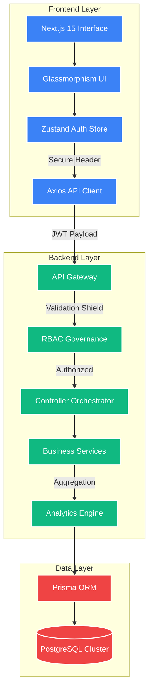
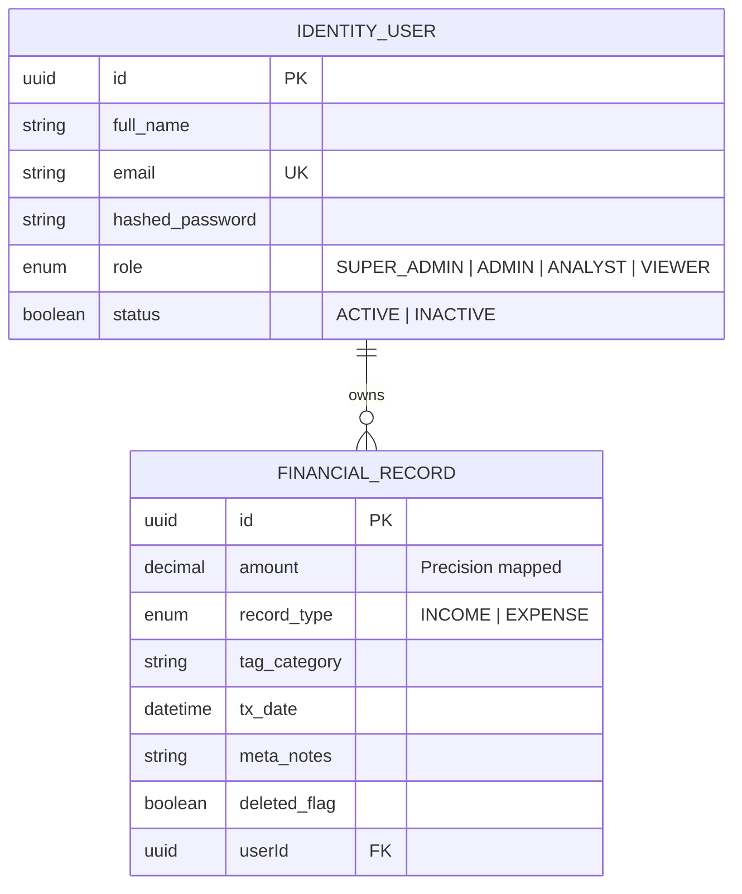

# 🏦 FinDash: The Ultimate Financial Intelligence & Governance Ecosystem

<p align="center">
  
</p>

<p align="center">
  
  
  
  
  
  
</p>

---

## 🏛️ **Executive Overview**

**FinDash** is a high-fidelity, enterprise-ready financial intelligence platform designed to provide a unified interface for complex fiscal management. It bridges the gap between massive transactional data processing and high-end visual storytelling. Built with a focus on **Zero-Trust security**, **Hierarchical Data Integrity**, and **Ultra-Fluid UX**, FinDash is the definitive solution for organizational fiscal transparency.

This project is divided into two distinct but perfectly synchronized domains:
1.  **The Intelligence Node (Backend)**: A low-latency scaling engine handling RBAC, analytics, and data persistence.
2.  **The Visual Interface (Frontend)**: A modern, glassmorphism-inspired dashboard for real-time interaction.

---

## 🚀 **The Technical Stack Intelligence**

### 🧠 **Frontend: High-Fidelity UI Engine**
*   **Next.js 15 (App Router)**: Utilizing Server Components for initial load speed and Client Components for interactive analytics.
*   **Tailwind CSS v4**: Pioneering utility-first design with a custom-engineered glassmorphism system for a "premium" feel.
*   **Zustand (Global State)**: High-performance state management for handling authentication and user-preference synchronization.
*   **Framer Motion**: Powering fluid, micro-animated transitions between dashboard states.
*   **Recharts**: Sophisticated SVG-based data visualization library for rendering Wealth Trend Area Charts.
*   **Axios Ecosystem**: Advanced API communication layer with interceptors for automated JWT injection and error handling.

### ⚙️ **Backend: The Core Processing Node**
*   **Node.js & Express.js**: The reactive core handling high-frequency request-response cycles.
*   **TypeScript**: Enforcing strict type-safety across the entire transaction lifecycle.
*   **Prisma ORM**: The Data Access Layer (DAL) that ensures zero-SQL injection risk and automated schema migrations.
*   **PostgreSQL**: The relational foundation chosen for its ACID compliance and transactional reliability.
*   **JWT (JSON Web Tokens)**: Stateless authentication protocol for cross-domain identity verification.
*   **Bcrypt.js**: High-entropy password hashing for vault-level credential security.
*   **Zod**: The "Validation Firewall" that scrubs every bit of incoming data against strict schemas.

---

## 📐 **The Master Architecture (Full System flow)**

Our architecture avoids "monolithic sprawl" by adhering to clear, unidirectional data flow and strict boundary isolation.



---

## 🛡️ **The Role Governance Protocol: Solving Permissions with "Super Admin"**

In complex financial systems, a standard `Viewer-Analyst-Admin` model often hits a bottleneck: **How do we maintain absolute system integrity when every admin can potentially modify each other's configuration?**

### **The Challenge: Viewer / Analyst / Admin Limitation**
1.  **Viewer**: Highly restricted. Read-only access to analytics.
2.  **Analyst**: Operational access. Can add/edit records but cannot manage system governance.
3.  **Admin**: High authority. Can manage records AND users.

### **The Solution: Integration of the "Super Admin" (System Guardian Bypass)**
We solved this by introducing the **Super Admin** concept—a high-level bypass mechanism implemented in our core `authMiddleware` and `roleMiddleware`.

*   **Logic Isolation**: While `Admin` handles the day-to-day organizational governance, the `Super Admin` acting as a **Root Guardian** ensures that even if an Admin's role is compromised, the core infrastructure remains protected.
*   **The Clearance Bypass**: In our code logic, whenever a role check is performed, the `Super Admin` ID is checked first. If matched, the role-checking logic is bypassed, granting immediate "System-Wide Clearance."

#### **RBAC Clearance Matrix**

| Feature Name | Viewer | Analyst | Admin | Super Admin |
| :--- | :---: | :---: | :---: | :---: |
| **Global Analytics** | ✅ | ✅ | ✅ | ✅ |
| **Historical Ledger** | ✅ | ✅ | ✅ | ✅ |
| **Create Recordings** | ❌ | ✅ | ✅ | ✅ |
| **Modify Identity** | ❌ | ✅ | ✅ | ✅ |
| **Full Deletions** | ❌ | ❌ | ✅ | ✅ |
| **Manage Admins** | ❌ | ❌ | ❌ | ✅ |
| **System Override** | ❌ | ❌ | ❌ | ✅ |

---

## 📊 **Core Features & Functionalities**

### **1. Financial Ledger Intelligence (CRUD+)**
*   **Soft Delete**: Instead of purging data, we flag records as `isDeleted`. This maintains fiscal auditability for 100% data recovery.
*   **Intelligent Auto-Type**: Adding a "Salary" or "Freelance" tag automatically switches the transaction type to `INCOME`, reducing human entry error.
*   **High-End Search**: Server-side, case-insensitive search engine capable of parsing thousands of categories instantly.

### **2. Analytics Engine (Dashboard Summary)**
*   **Total Pulse**: Instant calculation of Income, Expense, and Net Profitability.
*   **Monthly Trends**: Aggregated logic that computes revenue curves over time.
*   **Category Velocity**: Visualizing where the money flows via category-wise distribution logic.

### **3. Hierarchical UI (RBAC-Driven)**
*   The frontend **React components** are role-aware.
*   An `ANALYST` sees the "Add Transaction" button, while a `VIEWER` sees a curated read-only view.
*   The `Admin Panel` only materializes for identities with Level 3+ clearance.

---

## 📡 **API Command Center & Testing Manual**

### **1. Authentication Protocol**

#### **Request: User Establishment (Register)**
`POST /api/auth/register`
```json
{
    "name": "Alex Admin",
    "email": "alex@findash.io",
    "password": "strongPassword123",
    "role": "ADMIN"
}
```

#### **Request: Identity Verification (Login)**
`POST /api/auth/login`
```json
{
    "email": "alex@findash.io",
    "password": "strongPassword123"
}
```
**Response Details:**
*   Returns an `encryptedToken`.
*   Includes user metadata (`role`, `name`) for frontend hydration.

---

### **2. Financial Records Ledger**

#### **Request: Fetch Paginated Transactions**
`GET /api/records?page=1&limit=5&search=Food`
```json
{
    "success": true,
    "data": [
        {
            "id": "7f8a...",
            "amount": 250,
            "category": "Food",
            "type": "EXPENSE",
            "date": "2026-04-05"
        }
    ],
    "meta": { "total": 120, "pages": 24 }
}
```

#### **Request: Transaction Persistence (Create)**
`POST /api/records`
```json
{
    "amount": 5000,
    "category": "Salary",
    "type": "INCOME",
    "date": "2026-04-01",
    "notes": "Main job payout"
}
```

---

### **3. Intelligence Dashboard**

#### **Request: Summary Calculation**
`GET /api/dashboard/summary`
```json
{
    "success": true,
    "data": {
        "totalIncome": 120000,
        "totalExpense": 45000,
        "netBalance": 75000,
        "trends": { "Jan": 20000, "Feb": 25000 },
        "categories": { "Entertainment": 1500, "Rent": 3500 }
    }
}
```

---

## 🛡️ **Edge Case & Security Considerations**

*   **Case Normalization**: Searching for "REnt" or "rent" results in the same query result.
*   **Data Isolation**: Every Prisma query contains a strict `WHERE userId = req.user.id` clause. Even an SQL-injection attempt would be capped by the user boundary.
*   **JWT Lifecycle**: Tokens have a calibrated expiration time. 401 Interceptors on the frontend automatically trigger "Session Revoked" workflows.
*   **Soft Deletion Accuracy**: Analytics engine sums only `isDeleted: false` records, ensuring that "deleted" records don't inflate the financial trends.

---

## 📈 **Data Engineering Schema (ERD)**



---

## 🚀 **Rapid Setup & Initialization**

### **Prerequisites**
*   Node.js (v20+)
*   Docker or local PostgreSQL instance

### **Step 1: Backend Foundation**
```bash
cd backend
npm install
# Create .env based on .env.example
# Setup DATABASE_URL and JWT_SECRET
npx prisma db push
npm run dev
```

### **Step 2: Frontend Interface**
```bash
cd frontend
npm install
# Configure NEXT_PUBLIC_API_URL in .env.local
npm run dev
```

---

## 📌 **Logical Assumptions & Trade-offs**

1.  **Single Base Currency**: For the MVP, we assume all calculations are in a single base currency (e.g., INR/USD) to ensure accuracy in aggregation.
2.  **UTC Standardization**: All timestamps are persisted in UTC to prevent drift in across-timezone analytics.
3.  **Local Storage Auth**: Tokens are stored in a secured Zustand store, which persists during the session for enhanced UX.
4.  **Soft Delete Focus**: We prioritized Data Recovery over hard space optimization, as financial audit trails are crucial.

---

## 🔮 **The Evolution Path (Roadmap)**

*   [ ] **AI Fiscal Forecaster**: Predictive analysis of monthly expenses using Vector-based ML models.
*   [ ] **Document Vault**: Automated generation of Fiscal Audit reports in PDF/CSV.
*   [ ] **Multi-Currency Engine**: Real-time FX normalization for international operations.
*   [ ] **Webhook Integration**: Triggering notifications for high-value transactions.

---

<p align="center">
  <b>FinDash Intelligence | High Fidelity Interface</b><br>
  🛡️ Identity Verified | 📊 Analytics Ready | 🚀 High Scalability
  <br>
  Developed with focus on <b>Industrial Stability, UX Excellence, and Scalable Logic</b>
</p>
