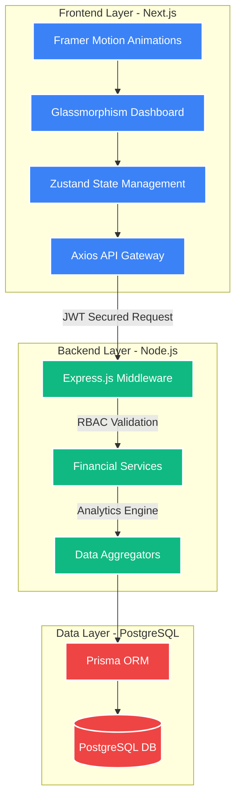
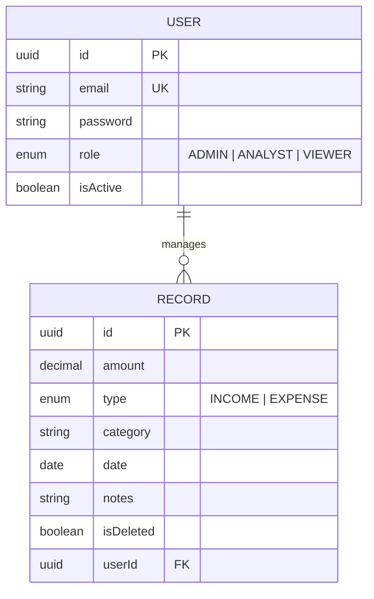

# 🏦 FinDash: Advanced Financial Intelligence Ecosystem

<p align="center">
  
</p>

---

### 🛡️ **Empowering Financial Governance through Intelligent Architecture**

FinDash is a comprehensive, enterprise-grade financial management ecosystem designed to bridge the gap between complex data processing and intuitive user interaction. This repository follows a strictly decoupled architecture, integrating a high-performance **Node.js/Prisma/PostgreSQL** backend with a high-fidelity **Next.js 15** frontend.

---

## 📖 **Table of Contents**

*   [🌟 Project Vision & Problem Statement](#-project-vision--problem-statement)
*   [🏗️ Unified Ecosystem Architecture](#️-unified-ecosystem-architecture)
*   [🛡️ Hierarchical Access Control (RBAC)](#️-hierarchical-access-control-rbac)
*   [📡 API Intelligence & Testing Guide](#-api-intelligence--testing-guide)
*   [🔒 Security & Engineering Standards](#-security--engineering-standards)
*   [📈 Data Engineering & Schema](#-data-engineering--schema)
*   [🚀 Rapid Deployment Protocol](#-rapid-deployment-protocol)

---

## 🌟 **Project Vision & Problem Statement**

FinDash was engineered to solve the complex challenge of **multi-tier financial governance**. In modern organizations, data must be accessible but strictly guarded based on organizational hierarchy. 

### **How we addressed the Core Requirements:**
*   **User & Role Management**: Implemented a dynamic status and multi-role system (`VIEWER`, `ANALYST`, `ADMIN`).
*   **Financial Records**: Full CRUD capabilities with intelligent auto-categorization logic.
*   **Dashboard Intelligence**: Aggregated calculation engines for MoM growth, trends, and liquidity summaries.
*   **Validation Firewall**: 100% request coverage with Zod Schemas and centralized error handling.

---

## 🏗️ **Unified Ecosystem Architecture**

The project is split into two specialized domains, ensuring maximum separation of concerns and independent scalability.



---

## 🛡️ **Hierarchical Access Control (RBAC)**

Access control is enforced at the **atomic level** on the backend and reflected visually on the frontend.

| Role | Permission Level | Capabilities | Restrictions |
| :--- | :--- | :--- | :--- |
| **Viewer** | Read-Only | View Dashboard, Trends, Historical Records. | Cannot Create, Edit, or Delete any data. |
| **Analyst** | Read/Write | View Insights, Create Records, Edit/Delete Transactions. | Cannot Manage Users or System Settings. |
| **Admin** | Full Authority | User Management, Role Assignments, System-wide Auditing. | No Restrictions. |

---

## 📡 **API Intelligence & Testing Guide**

All endpoints are protected by JWT and scoped by RBAC. Use the following examples for testing via `curl` or Postman.

### **1. Identity Module**
| Endpoint | Method | Example Payload | Description |
| :--- | :---: | :--- | :--- |
| `/api/auth/register` | `POST` | `{"email": "...", "password": "...", "role": "ANALYST"}` | Identity Provisioning |
| `/api/auth/login` | `POST` | `{"email": "...", "password": "..."}` | JWT Credential Exchange |

**Test Command (Login):**
```bash
curl -X POST http://localhost:5000/api/auth/login \
     -H "Content-Type: application/json" \
     -d '{"email": "admin@findash.io", "password": "securepassword"}'
```

### **2. Financial Ledger Module**
| Endpoint | Method | Params/Payload | Requirement |
| :--- | :---: | :--- | :--- |
| `/api/records` | `GET` | `?page=1&limit=10&search=Rent` | `VIEWER+` |
| `/api/records` | `POST` | `{"amount": 5000, "category": "Rent", "date": "..."}` | `ANALYST+` |

**Test Command (Create Record):**
```bash
curl -X POST http://localhost:5000/api/records \
     -H "Authorization: Bearer <YOUR_JWT_TOKEN>" \
     -H "Content-Type: application/json" \
     -d '{"amount": 1200, "category": "Consulting", "type": "INCOME", "date": "2026-04-05"}'
```

---

## 🔒 **Security & Engineering Standards**

*   **JWT Integrity**: Authentication is handled via stateless signed tokens with automatic session expiration.
*   **Password Cryptography**: Passwords never touch the database in raw form; we utilize **Bcrypt.js** with a 12-round salt.
*   **BORS (Boundary of Reliability System)**: Every incoming field is validated against **Zod** schemas before reaching the business logic.
*   **Soft Deletion**: Financial records are never truly purged; we implement an audit-friendly `isDeleted` flag for recovery and compliance.
*   **Rate Limiting**: Protection against brute-force and DDoS attempts in production environments.

---

## 📈 **Data Engineering & Schema**



---

## 🚀 **Rapid Deployment Protocol**

### **Prerequisites**
*   Node.js (v20+)
*   PostgreSQL Instance

### **Step 1: Backend Setup**
```bash
cd backend
npm install
cp .env.example .env # Tune your DB credentials
npx prisma db push
npm run dev
```

### **Step 2: Frontend Setup**
```bash
cd frontend
npm install
npm run dev
```

---

## 🔮 **Future Roadmap**

*   [ ] **Financial Forecaster**: AI-driven predictive modeling for future balance trends.
*   [ ] **Report Generator**: Automated PDF/CSV export for auditing.
*   [ ] **Multi-Currency Support**: Real-time FX conversion for international accounts.

---

<p align="center">
  <b>FinDash Intelligence | High Fidelity Interface</b><br>
  🛡️ Identity Verified | 📊 Analytics Ready | 🚀 High Scalability
  <br>
  Developed with focus on <b>Performance, Security, and Scalable UX</b>
</p>
