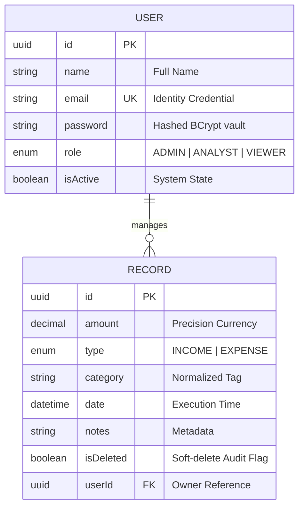

# 🏦 FinDash: High-Fidelity Financial Intelligence Ecosystem

<p align="center">
  
</p>

<p align="center">
  
  
  
  
  
  
</p>

---

### 🛡️ **FinDash: Engineering Financial Governance**

FinDash is a high-fidelity, enterprise-grade financial management ecosystem designed to bridge the gap between complex data processing and intuitive user interaction. This repository follows a strictly decoupled architecture, integrating a high-performance **Node.js/Prisma/PostgreSQL** backend with a high-fidelity **Next.js 15** frontend.

---

## 🏗️ **Architectural Blueprint**

Our architecture follows a strictly decoupled **Client-Server-Persistence** model, optimized for horizontal scalability and independent deployment.

```text id="architecture-map"
Client Layer (Next.js 15)
  ↓
API Interceptor Gateway (Axios)
  ↓
Validation Shield (Zod Schemas)
  ↓
Authentication Firewall (JWT)
  ↓
Authorization Governance (Hierarchical RBAC)
  ↓
Controllers (Request Orchestration)
  ↓
Services (Business Intelligence Logic)
  ↓
Data Access Layer (Prisma ORM)
  ↓
Primary Persistence (PostgreSQL)

Error Management → Centralized Global Middleware
```

---

## 🌟 **Key Intelligence Highlights**

*   **Modular Architecture**: Clean separation of concerns with a Service-Controller pattern for maximum testability.
*   **Analytics Engine**: Sophisticated logic for real-time Income/Expense aggregation, Monthly Growth Trends, and Category Velocity.
*   **Hierarchical RBAC**: Fine-grained access control (VIEWER, ANALYST, ADMIN) enforced at the atomic level.
*   **Data Integrity**: 100% input validation via Zod, preventing edge-case data corruption.
*   **Regulatory Persistence**: Soft-delete functionality to maintain audit trails while ensuring a clean user interface.
*   **Search & Discovery**: High-performance, case-insensitive search with multi-field filtering and pagination metadata.

---

## 🔐 **Access Control Matrix (RBAC)**

| Role | Intent | Capabilities | Restrictions |
| :--- | :--- | :--- | :--- |
| **VIEWER** | Observation | Read dashboard analytics, view historical ledger. | Cannot create or modify any financial records. |
| **ANALYST** | Optimization | Manage financial records, update categories, analyze trends. | Cannot manage users or system roles. |
| **ADMIN** | Authority | Full system control, role assignment, user activation/deactivation. | Zero restrictions. |

---

## 📡 **API Documentation & Testing Guide**

### 🔑 **1. Authentication (Identity Establishment)**

#### **POST** `/api/auth/login`
- **Request Body**:
```json
{
  "email": "admin@findash.io",
  "password": "securepassword123"
}
```
- **Response**:
```json
{
  "success": true,
  "data": {
    "token": "JWT_AUTH_TOKEN_HERE"
  }
}
```

---

### 📊 **2. Financial Ledger (Record Management)**

#### **GET** `/api/records`
- **Purpose**: Fetches paginated, searchable, and filtered records.
- **Parameters**: `page=1`, `limit=10`, `search=rent`, `type=EXPENSE`, `category=Housing`.
- **Response**:
```json
{
  "success": true,
  "data": [
    {
      "id": "uuid-v4-record-id",
      "amount": 1200,
      "type": "EXPENSE",
      "category": "Rent",
      "date": "2026-04-05T00:00:00.000Z",
      "notes": "Monthly studio rent"
    }
  ],
  "meta": {
    "totalCount": 45,
    "totalPage": 5
  }
}
```

---

### 📈 **3. Analytics Engine (Dashboard Summary)**

#### **GET** `/api/dashboard/summary`
- **Purpose**: Real-time aggregation of financial velocity.
- **Response**:
```json
{
  "success": true,
  "data": {
    "totalIncome": 150000,
    "totalExpense": 7000,
    "balance": 143000,
    "categoryBreakdown": {
      "Freelance": { "income": 50000, "expense": 0 },
      "Food": { "income": 0, "expense": 3000 }
    },
    "monthlyTrends": {
      "2026-04": { "income": 100000, "expense": 4000 }
    }
  }
}
```

---

## 🛡️ **Access Control Scenarios (RBAC in Action)**

### ❌ **Sample: Forbidden Access (Role Conflict)**
If a **VIEWER** attempts to delete a record via `DELETE /api/records/:id`:
- **Response**:
```json
{
  "success": false,
  "message": "Forbidden: Higher authorization required"
}
```

### ❌ **Sample: Unauthorized (No Token)**
If a request is sent without the `Authorization` header:
- **Response**:
```json
{
  "success": false,
  "message": "Unauthorized: Identity not verified"
}
```

---

## ⚠️ **Edge Case & Reliability Engineering**

*   **Case-Insensitive Normalization**: Searching for "Food", "food", or "FOOD" yields identical results, ensuring user convenience.
*   **Duplicate Category Aggregation**: Handles inconsistent data entry by consolidating "Salary" and "salary" during the analytics phase.
*   **Atomic Deletion Guard**: Soft-delete ensures records are instantly removed from UI/Analytics but remain in the database for auditing purposes.
*   **Validation Firewall (Zod)**: Prevents malformed requests (e.g., negative amounts or invalid ISO dates) before they reach the DB.
*   **Data Isolation**: Guaranteed single-user scoping for every query, preventing cross-tenant data leakage.

---

## 📈 **Data Engineering Schema**



---

## 🧠 **Design Decisions & Logic Flow**

1.  **PostgreSQL**: Chosen for ACID compliance, essential for transactional financial integrity.
2.  **Prisma ORM**: Provides type-safe database abstraction, reducing schema drift and runtime query errors.
3.  **JWT Strategy**: Stateless authentication allows for horizontal backend scaling without session sharing.
4.  **Service-Controller Layering**: Isolates complex business logic (like MoM growth calculations) from request handling.
5.  **Soft Delete**: Enables historical auditing and accidental recovery without compromising analytics accuracy.

---

## 🚀 **Rapid Deployment Protocol**

### **Step 1: Backend Initialization**
```bash
cd backend
npm install
cp .env.example .env # Configure your DB_URL & JWT_SECRET
npx prisma db push
npm run dev
```

### **Step 2: Frontend Initialization**
```bash
cd frontend
npm install
npm run dev
```

---

## 📌 **Assumptions & Boundary Conditions**

*   **Single Currency**: The current version assumes a unified currency system (e.g., USD/INR).
*   **User Isolation**: Users only have visibility into records they personally created or managed.
*   **Date Precision**: All date calculations are based on UTC to avoid timezone drift in analytics.

---

## 🔮 **Future Roadmap & Scalability**

*   [ ] **Financial Forecaster**: AI-driven predictive modeling for future balance trends.
*   [ ] **Report Generator**: Automated PDF/CSV export for auditing.
*   [ ] **Multi-Currency Support**: Real-time FX conversion for international accounts.

---

<p align="center">
  <b>FinDash Intelligence | High Fidelity Interface</b><br>
  🛡️ Identity Verified | 📊 Analytics Ready | 🚀 High Scalability
  <br>
  Developed with focus on <b>Performance, Security, and Professional Fiscal Governance</b>
</p>
