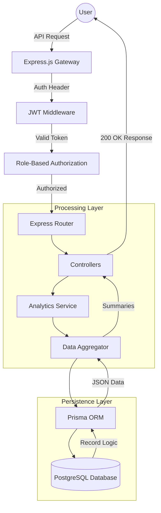
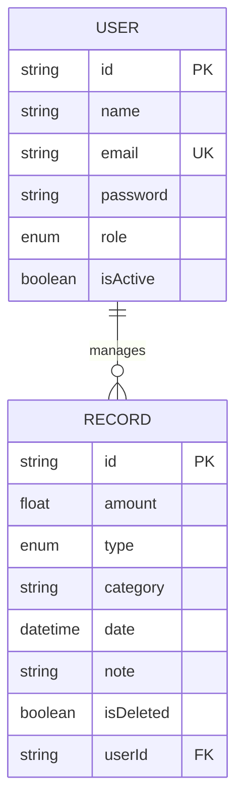

# 🏦 FinDash Backend Infrastructure

A high-fidelity, enterprise-grade financial intelligence API. This repository serves as the core processing engine for the FinDash ecosystem, handling complex financial aggregations, multi-tier security, and real-time analytics calculations.

---

## 🏗️ System Architecture & Data Flow

This backend follows the **Controller-Service-Repository** pattern for maximum separation of concerns and maintainability.

---

## 🚀 Technological Stack Intelligence

### Core Engine
*   **Node.js & Express.js**: Chosen for their non-blocking I/O and vast middleware ecosystem. We use a modular routing structure to ensure horizontal scalability as the feature set grows.
*   **Prisma ORM**: Utilized as the Data Access Layer (DAL). It provides type-safe database queries and automated migrations, reducing the risk of SQL injection and schema drift.

### Security & Access Control
*   **JWT (JSON Web Tokens)**: Decoupled authentication mechanism. It allows the frontend to maintain a stateless session, improving performance on the distributed dashboard.
*   **Bcrypt.js**: Industry-standard hashing for vault passkeys. No raw passwords ever hit the persistence layer.
*   **RBAC Middleware**: A custom-engineered gatekeeper that checks user role metadata against route permissions before execution.

### Data Processing
*   **Date-fns**: The "Temporal Engine" of the project. It handles the complex math required for 30-day daily trends and Month-over-Month (MoM) growth deltas.
*   **Zod**: The "Validation Firewall". Every bit of incoming data is scrubbed against a strict schema before the controller even touches it.

---

## 🛡️ Role-Based Action Matrix (RBAC)

The system enforces a strict hierarchy to ensure data integrity and security clearance.

| Feature | VIEWER | ANALYST | ADMIN |
| :--- | :--: | :--: | :--: |
| Access Dashboard Analytics | ✅ | ✅ | ✅ |
| View System Ledger | ✅ | ✅ | ✅ |
| Create Financial Entries | ❌ | ✅ | ✅ |
| Update/Edit Entries | ❌ | ✅ | ✅ |
| Delete Entries (Soft Delete) | ❌ | ✅ | ✅ |
| Manage User Roles | ❌ | ❌ | ✅ |
| Change User Status | ❌ | ❌ | ✅ |

---

## 🧪 API Testing & Operations Manual

Test these endpoints using Postman, Insomnia, or `curl`.

### 1. Identity Establishment (Auth)
**POST** `/api/auth/register`
*   **Payload**: `{ "name": "John Doe", "email": "john@findash.io", "password": "pass", "role": "ANALYST" }`
*   **Result**: 201 Created. Establishes your system identity.

**POST** `/api/auth/login`
*   **Payload**: `{ "email": "john@findash.io", "password": "pass" }`
*   **Result**: Returns `token`. **Mandatory** for subsequent requests.

### 2. Financial Ledger Management (Records)
**GET** `/api/records?page=1&limit=10&search=Rent`
*   **Action**: Fetches paginated, searchable records.
*   **Headers**: `Authorization: Bearer <token>`

**POST** `/api/records`
*   **Payload**: `{ "amount": 5000, "type": "EXPENSE", "category": "Rent", "date": "2026-04-01" }`
*   **Testing Tip**: Try sending `"category": "Salary"`—The system will auto-switch the type to `INCOME` internally.

### 3. Intelligence Summaries (Dashboard)
**GET** `/api/dashboard/summary`
*   **Logic**: Executes the MoM comparison and Wealth Velocity trends.
*   **Logic Test**: Add a record for *last month* and *this month*. The `change` field in the response will show the calculated percentage delta.

---

## 📈 Database Schema Design

---

## 🛠️ Setup Protocol
1.  **Clone Source**
2.  **Synchronize Dependencies**: `npm install`
3.  **Variable Deployment**: Create `.env` based on `.env.example`.
4.  **Migrate Schema**: `npx prisma db push`
5.  **Initialize Engine**: `npm run dev`

Developed by **Infrastructure Group**.
🛡️ **Security**: Verified.
📊 **Scalability**: High.
