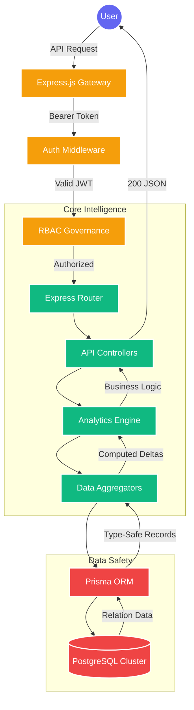
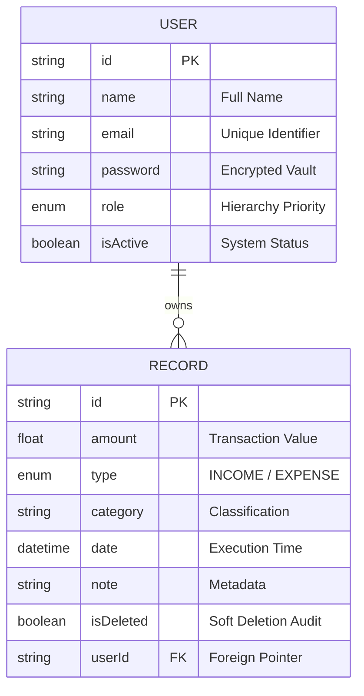

# 🏦 FinDash Backend Infrastructure

<p align="center">
  
</p>

---

### 🛡️ **The Financial Intelligence Engine**

FinDash Backend is a high-fidelity, enterprise-grade processing core designed for **real-time financial analytics**, **hierarchical identity management**, and **secure data orchestration**. Built on the modern Node.js ecosystem, it provides the backbone for seamless financial visualization and robust fiscal governance.

---

## 🎨 **System Architecture & Data Flow**

This system operates on a strictly decoupled **Controller-Service-Repository** pattern, ensuring each layer is independently scalable and testable.



---

## 🚀 **Technological Stack Intelligence**

### 🧠 **Core Engine**
*   **Runtime**: Node.js (v20+) with Express.js for low-latency request handling.
*   **Data Access Layer**: **Prisma ORM** for type-safe database interactions and automated schema migrations.
*   **Database**: PostgreSQL — chosen for its ACID compliance and handling of relational financial structures.

### 🔐 **Identity & Security Architecture**
*   **Governance**: Custom **Hierarchical RBAC** middleware managing three distinct tiers (VIEWER, ANALYST, ADMIN).
*   **Authentication**: Stateless JWT mechanism for scalable, distributed session management.
*   **Encryption**: Multi-layered hashing via **Bcrypt.js** (Rounds: 12) for account protection.
*   **Validation**: **Zod Schema Firewall** — every request is scrubbed against strict type definitions before processing.

---

## 🛡️ **Role-Based Access Governance**

| Module | Features | Viewer | Analyst | Admin |
| :--- | :--- | :---: | :---: | :---: |
| **Intelligence** | View Dashboard Analytics | ✅ | ✅ | ✅ |
| **Ledger** | Read Financial History | ✅ | ✅ | ✅ |
| **Operations** | Create/Edit/Delete Records | ❌ | ✅ | ✅ |
| **Security** | User Role Management | ❌ | ❌ | ✅ |
| **Governance** | Multi-system Settings | ❌ | ❌ | ✅ |

---

## 📈 **Data Engineering Schema**



---

## 📡 **Strategic API Endpoints**

| Namespace | Endpoint | Method | Responsibility |
| :--- | :--- | :--- | :--- |
| **Identity** | `/api/auth/login` | `POST` | Exchange credentials for secure JWT Access. |
| **Identity** | `/api/auth/register` | `POST` | Provision new system identity with default role. |
| **Ledger** | `/api/records` | `GET` | Paginated retrieval with dynamic search filters. |
| **Ledger** | `/api/records` | `POST` | Financial record persistence with auto-type switching. |
| **Intelligence** | `/api/dashboard/summary` | `GET` | MoM comparison and Wealth Velocity trends. |

---

## 🛠️ **Deployment Protocol**

1.  **Repository Synchronization**
    ```bash
    git clone <repository_url> && cd backend
    ```
2.  **Environment Calibration**
    *   Create `.env` using `.env.example` as a template.
    *   Configure `DATABASE_URL` and `JWT_SECRET`.
3.  **Engine Initialization**
    ```bash
    npm install
    npx prisma db push
    npm run dev
    ```

---

<p align="center">
  <b>Developed by FinDash Engineering</b><br>
  🛡️ Identity Verified | 📊 Analytics Ready | 🚀 High Scalability
</p>
