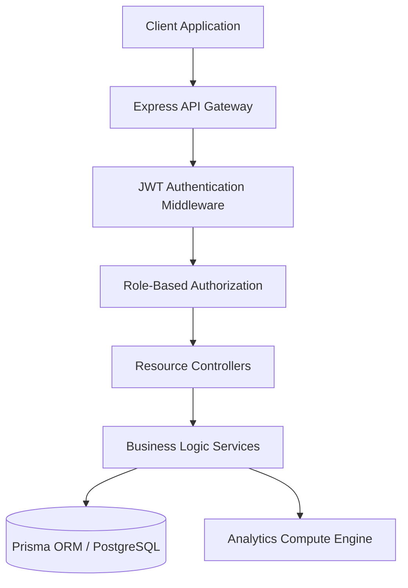
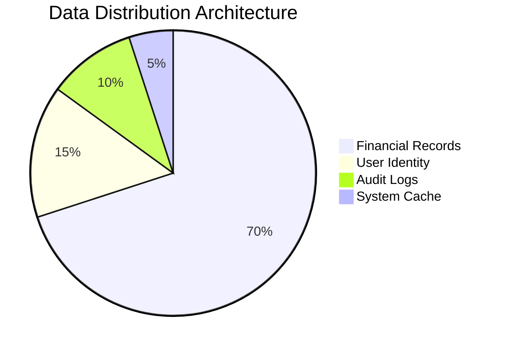

# 🏦 FinDash Backend Infrastructure

A high-performance, enterprise-grade financial intelligence API built with a modular **Controller-Service-Repository** architecture. This backend handles complex financial aggregations, role-based access control (RBAC), and real-time data synchronization.

---

## 🏗️ System Architecture

---

## 🚀 Key Technological Stack
*   **Engine**: Node.js / Express.js (v5.x)
*   **Database**: PostgreSQL via **Prisma ORM**
*   **Security**: JWT (Secure Tokens), Bcrypt (Password Hashing)
*   **Validation**: Zod (Schema-strict input validation)
*   **Analytics**: Date-fns (Complex temporal calculations)

---

## 🧩 Advanced Logic Features

### 1. Intelligence Analytics Engine
The backend doesn't just store data; it computes it.
*   **MoM Growth Performance**: Compares current month data against the previous month to calculate real-world growth/shrinkage deltas.
*   **Wealth Velocity**: Generates daily and monthly trend aggregates for high-fidelity curve charting.
*   **Category Partitioning**: Dynamic grouping of transactions based on inflow (Income) and outflow (Expense).

### 2. Role-Based Access Control (RBAC)
Multi-tier security clearance system:
*   **ADMIN**: Full system control, user management, and ledger oversight.
*   **ANALYST**: Capability to create, update, and manage financial records.
*   **VIEWER**: Read-only access to dashboard intelligence.

### 3. Data Integrity & Soft Delete
*   Implements **Soft Deletion** to ensure historical data tracking while maintaining a clean active state.
*   Strict **Zod validation** on all ingress data to prevent corruption.

---

## 🛣️ API Documentation

### Authentication Cluster
| Endpoint | Method | Security | Description |
| :--- | :--- | :--- | :--- |
| `/api/auth/register` | POST | Public | Identity creation and role assignment |
| `/api/auth/login` | POST | Public | Token generation and session start |

### Financial Ledger Cluster
| Endpoint | Method | Security | Description |
| :--- | :--- | :--- | :--- |
| `/api/records` | GET | Protected | Multi-filter paginated transaction fetch |
| `/api/records` | POST | Analyst+ | New financial entry deployment |
| `/api/records/:id` | DELETE | Analyst+ | Resource decommission (Soft Delete) |

### Intelligence Cluster
| Endpoint | Method | Security | Description |
| :--- | :--- | :--- | :--- |
| `/api/dashboard/summary` | GET | Protected | Real-time analytics and wealth trends |

---

## 🛠️ Deployment & Launch
1.  **Clone Repository**
2.  **Install Dependencies**: `npm install`
3.  **Configure Environment**: Create `.env` from `.env.example`
4.  **Database Migration**: `npx prisma db push`
5.  **Initialize Engine**: `npm run dev`

---

## 📊 Performance Metrics

Designed for **Scalability**, **Security**, and **Speed**.
Developed by **Infrastruture Group**.
