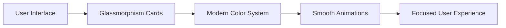
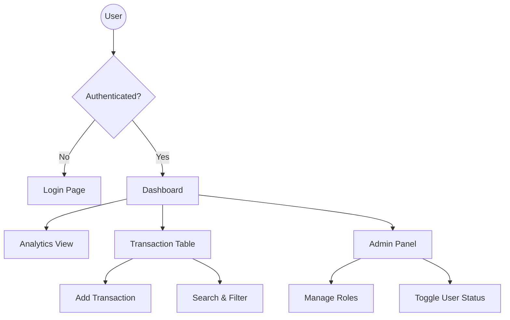
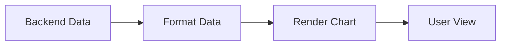

# 📊 FinDash Frontend

### 🚀 Modern Financial Analytics Dashboard (Next.js)

<p align="center">
  
  
  
  
  
  
</p>

<p align="center">
  <b>High-performance financial dashboard with real-time analytics, role-based UI, and premium UX</b>
</p>

---

## 🌟 Overview

FinDash Frontend is a **modern financial dashboard UI** built to visualize income, expenses, and analytics in a clean and interactive way.

It is designed with:

* ⚡ High performance (Next.js SSR)
* 🎨 Premium UI (glassmorphism design)
* 📊 Data visualization (charts & analytics)
* 🔐 Secure integration with backend (JWT-based)

---

## 🎨 UI Design Philosophy

### 🧠 Goal: **Information Density with Clarity**

Instead of cluttered dashboards, this UI focuses on:

* Showing **maximum insights**
* While maintaining **clean readability**

---

### 🎨 Visual System Breakdown



### ✨ Key Design Elements

* **Glassmorphism UI** → blurred, layered cards
* **Consistent spacing system** → clean layout
* **Smooth animations** → improves UX feel
* **Color-coded insights** → quick financial understanding

---

## 🚀 Tech Stack

### ⚙️ Core Framework

| Tech                 | Purpose       |
| -------------------- | ------------- |
| Next.js (App Router) | SSR + Routing |
| Tailwind CSS v4      | Styling       |
| TypeScript           | Type safety   |

---

### 🔄 State & API Layer

| Tech         | Role                                |
| ------------ | ----------------------------------- |
| Zustand      | Global state (auth + user)          |
| Axios        | API communication                   |
| Interceptors | Auto JWT injection + error handling |

---

### 📊 Visualization & UI

| Tech          | Use              |
| ------------- | ---------------- |
| Recharts      | Financial charts |
| Framer Motion | Animations       |

---

## 👤 User Flow (How App Works)



---

## 📊 Core Features

### 📈 1. Analytics Dashboard

* Total income & expenses
* Balance overview
* Monthly trends
* Category-wise insights

👉 Powered by backend aggregation APIs

---

### 📄 2. Transaction Ledger

* View all transactions
* Search (debounced)
* Filter by category/type
* Pagination

---

### ➕ 3. Add Transaction System

* Smart category handling
* Auto updates dashboard
* Instant UI refresh

---

### 🔐 4. Role-Based UI (RBAC)

| Role    | UI Access    |
| ------- | ------------ |
| VIEWER  | Read-only    |
| ANALYST | Add/Edit     |
| ADMIN   | Full control |

👉 UI automatically adapts based on role

---

## 📊 Charts & Visualization

### 📈 Wealth Trend Chart

* Smooth area chart (Recharts)
* Displays income vs expenses over time
* Helps track financial growth



---

### 🎯 Chart Features

* Dynamic scaling
* Smooth curves (monotone)
* Real-time updates
* Responsive design

---

## ⚡ Performance Optimizations

* SSR (Next.js App Router)
* Minimal CSS (Tailwind JIT)
* Debounced API calls
* Efficient state management (Zustand)

---

## 🔐 Security Handling

* JWT stored in Zustand
* Axios interceptor injects token
* Handles 401 → auto redirect to login
* Role-based UI restrictions

---

## 🧪 Testing Guide

### ✅ Manual Test Cases

1. **Auth Protection**

   * Visit `/dashboard` without login → redirected

2. **Role Restriction**

   * Login as VIEWER → cannot add/delete

3. **Live Updates**

   * Add transaction → dashboard updates instantly

---

## ⚙️ Setup Instructions

```bash
# Clone repo
git clone <repo-url>

# Install dependencies
npm install

# Setup env
NEXT_PUBLIC_API_URL=your_backend_url

# Start app
npm run dev
```

---

## 🔗 Backend Integration

This frontend connects with:
👉 Finance Dashboard Backend API

Handles:

* Authentication
* Records
* Analytics

---

## 🔮 Future Improvements

* Dark/Light theme toggle
* Export reports (PDF/CSV)
* Real-time notifications
* Mobile optimization

---

## 💼 Resume Highlights

* Built **Next.js financial dashboard with SSR**
* Implemented **RBAC-based UI system**
* Integrated **real-time analytics using charts**
* Designed **scalable frontend architecture**
* Optimized **API handling with interceptors**

---

## 🎯 Final Note

This project demonstrates:

* Modern frontend engineering
* Scalable UI architecture
* Real-world dashboard design

👉 Built with focus on **performance, usability, and production standards**

---

<p align="center">
  ⭐ Star the repo if you like it!
</p>
