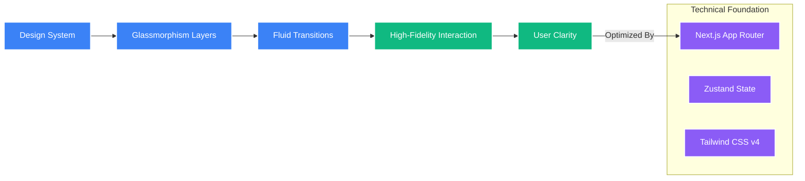
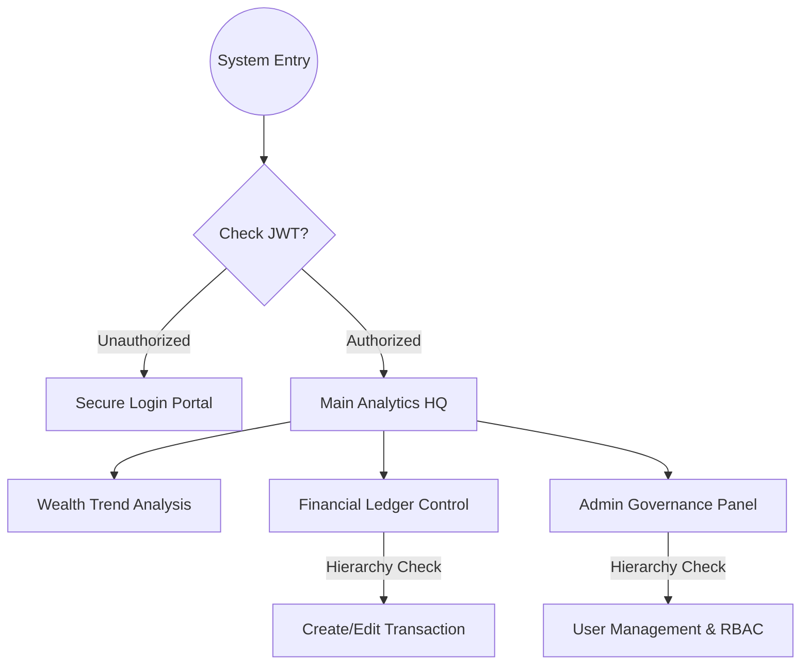

# 📊 FinDash Frontend Intelligence

<p align="center">
  
</p>

---

### 🚀 **Modern Financial Analytics Visualizer**

FinDash Frontend is a **high-performance, aesthetically premium financial dashboard** built with Next.js. It transforms raw financial data into actionable insights through sophisticated visualization, intuitive UX, and robust state management.

---

## 🌟 **Key Capabilities & Strategic Features**

### 📈 **Advanced Analytics Dashboard**
*   **Real-time Insights**: Pulse monitor for Total Income, Expenses, and Net Balance.
*   **Trend Analysis**: Dynamic Area Charts visualizing "Wealth Velocity" over 30 days.
*   **Category breakdown**: Intelligent distribution of spending via Pie/Bar charts.

### 🔐 **Hierarchical RBAC UI**
*   **Identity-Aware Interface**: The UI dynamically reconfigures itself based on user roles (VIEWER, ANALYST, ADMIN).
*   **Restricted Actions**: Features like "Add Transaction" or "User Management" are hidden or disabled for restricted tiers.

### 📄 **Financial Ledger Management**
*   **Fluid Table System**: High-speed, paginated transactions with debounced search.
*   **Smart Entry**: Category-aware transaction creation with instant dashboard reconciliation.

### 🎨 **Premium Design Architecture**
*   **Glassmorphism UI**: High-end aesthetic with blurred, layered components.
*   **TailwindCSS v4**: Cutting-edge, lightning-fast styling with modern utility-first patterns.
*   **Framer Motion**: Smooth, micro-animated transitions for enhanced interactivity.

---

## 🧠 **The Design Philosophy**

Instead of traditional cluttered finance apps, FinDash focuses on **Information Density with Clarity**.



---

## 🚀 **Technological Stack Intelligence**

### ⚙️ **Core Framework**
*   **Next.js 15 (App Router)**: Hybrid SSR/CSR approach for maximum SEO and performance.
*   **TypeScript**: Strict type definitions for a zero-runtime-error environment.
*   **Tailwind CSS v4**: Next-gen styling engine for modern glassmorphism.

### 🔄 **Intelligence Layer**
*   **Zustand Architecture**: Lightweight, high-performance global state managing Auth, User Profile, and UI states.
*   **Axios Ecosystem**: Advanced API communication with **Interceptors** for automated JWT injection and 401-auto-logic.
*   **Recharts Engine**: Professional SVG-based data visualization for financial trends.

---

## 👤 **The Integrated User Journey**



---

## ⚡ **Performance & Security Protocols**

### 🔒 **Security Measures**
*   **Encrypted State Storage**: Secure persistence of user information.
*   **Network Interceptor Firewall**: Automated token renewal and request hardening.
*   **Client-Side Guardrails**: Middleware-protected routing for unauthorized attempts.

### 🚄 **Latency Minimization**
*   **SSR Pre-fetching**: Immediate data availability on initial load.
*   **Debounced API Requests**: Reducing server load during high-frequency searching.
*   **Optimized Assets**: Next/Image for lightning-fast visual rendering.

---

## ⚙️ **The Setup Protocol**

1.  **Clone Source**
    ```bash
    git clone <repository_url> && cd frontend
    ```
2.  **Synchronize Resources**
    ```bash
    npm install
    ```
3.  **Environment Connectivity**
    *   Set `NEXT_PUBLIC_API_URL` in `.env.local` to point to the FinDash Backend.
4.  **Initiate Engine**
    ```bash
    npm run dev
    ```

---

<p align="center">
  <b>FinDash Intelligence | High Fidelity Interface</b><br>
  🎨 Premium UX | 🚀 SSR Optimized | 🛡️ Secure Access
</p>
