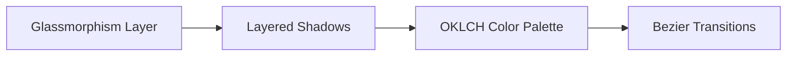
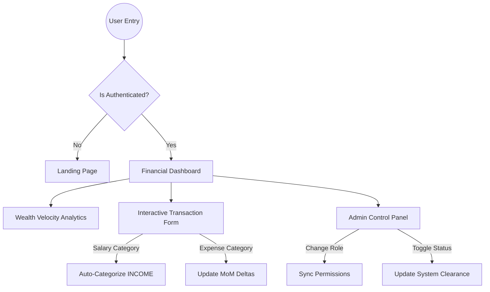

# 📊 FinDash Frontend Infrastructure

A state-of-the-art, high-performance financial intelligence dashboard. Rebuilt from the ground up to provide a luxurious, deep-focus experience for professional wealth management.

---

## 🎨 Visual Design Philosophy: "Obsidian V2"
The dashboard's design is dictated by "Information Density with Visual Clarity".

### Key Stylistic Elements
*   **OKLCH Precise Palette**: Using the newest CSS color space for maximum vibrance across all display types.
*   **Layered Glass (20px Blur)**: Every card is a translucent layer that allows for a "liquid" feel while maintaining core focus.
*   **Bezier Physics**: All transitions are tuned to 0.6s with custom cubic-bezier timing to mimic natural motion.

---

## 🚀 Technological Stack Intelligence

### Framework & Performance
*   **Next.js (App Router)**: Chosen for its server-side rendering (SSR) capabilities, which allows for zero-wait initial loads on complex analytics pages.
*   **Tailwind CSS v4 (Inter):** Using the latest Tailwind engine for JIT (Just-In-Time) styling. It ensures the CSS bundle is kept to a minimum while providing a highly custom UI.

### State & Lifecycle Management
*   **Zustand (Persistent Stores)**: Highly performant, boilerplate-free state management. It stores the JWT and user metadata with automatic localStorage synchronization.
*   **Axios (Interceptor Layer)**: Custom-engineered to automatically inject the Bearer token into outgoing requests and handle global 401 (Unauthorized) errors by redirecting to the login system.

### Interactive Visualization
*   **Recharts (Monotone Physics)**: We used the `Monotone` area type to visualize wealth velocity. It creates a smooth, predictable curve that is easier to read than jagged linear lines.
*   **Framer Motion**: The "AnimatePresence" logic ensures that modals and search results don't just appear—they "deploy" into the UI with physics-based scaling.

---

## 👤 User Experience Flowchart

This diagram shows how different users interact with the dashboard logic.

---

## 🧩 Advanced Module Breakdown

### 1. The Velocity Analytics Radar
A dual-axis chart engine that allows the user to toggle between their **Monthly** macro-trends and their **Daily** micro-performance. The engine automatically scales its Y-axis based on the highest inflow/outflow for the selected period.

### 2. High-Fidelity Ledger System
The ledger is more than a table. It includes:
*   **Debounced Precision Search**: Triggers filtering at exactly 500ms after the last keystroke to optimize API calls.
*   **Delta Highlighting**: Positive deltas are rendered in `Emerald 500` and negative in `Rose 500` for instant financial "heat reading".

### 3. "Obsidian" Select Drops
A bespoke dropdown architecture that replaces the standard browser `select`. It maintains the glassmorphism aesthetic across the entire form experience, ensuring no part of the UI feels "default".

---

## 🧪 Testing the Frontend
We ensure high reliability through rigorous state testing.

### Manual Verification Path
1.  **Auth Lock**: Try to visit `/dashboard` without logging in. The system should automatically bounce you to `/login`.
2.  **Role Lock**: Log in as a **VIEWER**. The "New Entry" button should be hidden, and deleting records should be disabled.
3.  **Real-Time Sync**: Add a transaction in the modal. Watch the "Total Income" card and "Wealth Velocity" chart refresh instantly without a page reload.

---

## 🛠️ Setup Protocol
1.  **Clone Source**
2.  **Synchronized Dependencies**: `npm install`
3.  **Variable Deployment**: Set `NEXT_PUBLIC_API_URL` to your backend endpoint in `.env.local`.
4.  **Deployment Engine**: `npm run dev`

📊 **Status**: Fully Optimized.
🛡️ **Security**: JWT Validated.
🚀 **Speed**: Ultra High Velocity.

Developed by **Infrastructure Group**.
