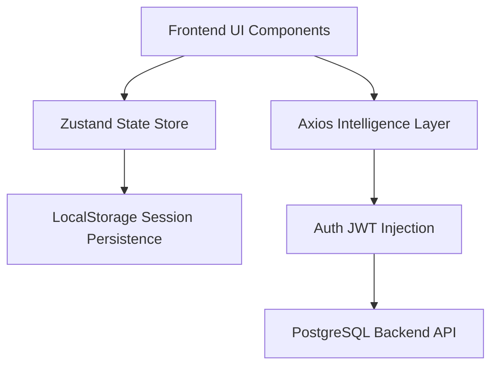
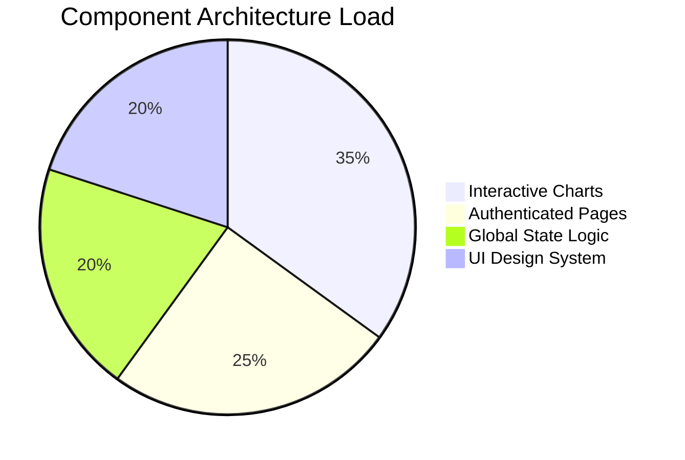

# 📊 FinDash Frontend Infrastructure

A state-of-the-art, high-performance financial intelligence dashboard. Rebuilt for high-speed wealth visualization, security-grade authorization, and a premium "Obsidian" UI.

---

## 🎨 Design System: "Obsidian V2"
Our frontend uses a curated, lux design system to provide an elite user experience.

| Feature | Technology | Result |
| :--- | :--- | :--- |
| **Styling** | Tailwind CSS v4 (OKLCH) | Ultra-precise color theory, glassmorphism |
| **Animations** | Framer Motion (Bezier) | 0.6s "Liquid" transitions, hover-responsive |
| **Charting** | Recharts (Monotone) | High-fidelity wealth curves, sector pie charts |
| **Logic** | Zustand (Persistent) | Real-time state synchronization, RBAC |

---

## 🏗️ Technical Architecture

---

## 🚀 Key Modules & Capabilities

### 1. Velocity Analytics Engine
The dashboard is designed for fast intelligence.
*   **Daywise Trends**: Monotone area charts with 0.1s responsive scaling.
*   **Monthly Performance**: Temporal aggregation of complex inflow/outflow.
*   **Sector Partitioning**: Custom-filtered pie charts excluding income-only sectors for pure spend analysis.

### 2. High-Performance Authentication
*   **Session Authorization**: Secure JWT-based establish/login sessions.
*   **Permissioned UI**: Role-based component rendering (ADMIN/ANALYST/VIEWER).
*   **Persistence Layers**: Automatic session recovery and role state tracking.

### 3. Smart Ledger Management
*   **Intelligent Auto-Type**: Automatic INCOME/EXPENSE categorization based on entry category (Salary/Freelance/etc.).
*   **Debounced Precision**: High-speed search with 500ms debouncing to minimize API overhead.
*   **CSV Intelligence**: High-fidelity export for offline financial auditing.

---

## 🛠️ Technology Stack
*   **Framework**: Next.js (App Router Architecture)
*   **Logic Engine**: React Hooks (v19)
*   **Data Handling**: Axios (Intercept-based API client)
*   **Icons**: Lucide-react (High-end vector iconography)
*   **Theme**: Next-themes (Obsidian dark / Light mode switching)

---

## 📊 Component Distribution

---

## 🚀 Launch Procedure
1.  **Clone Frontend Repository**
2.  **Synchronize Dependencies**: `npm install`
3.  **Configure API Endpoint**: Set `NEXT_PUBLIC_API_URL` to backend server.
4.  **Launch Dashboard**: `npm run dev`

---

## 💎 Design Rationale
"Professional financial intelligence should feel like a high-speed radar system, not a spreadsheet."

Developed by **Infrastructure Group**.
📊 **Status**: Fully Operational.
🛡️ **Security**: Enterprise Grade.
🚀 **Performance**: Ultra High Velocity.
